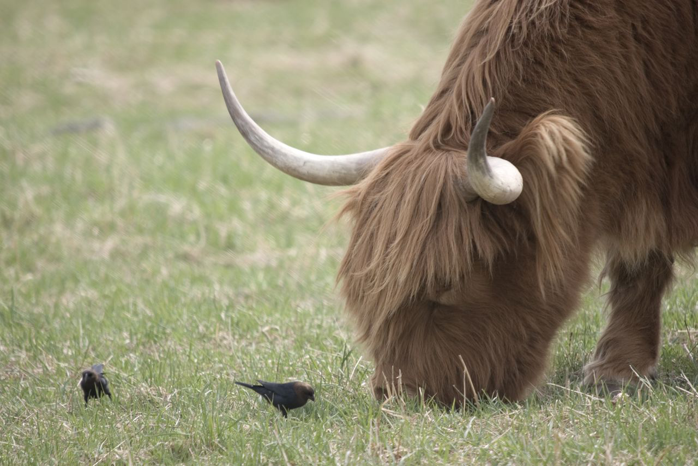
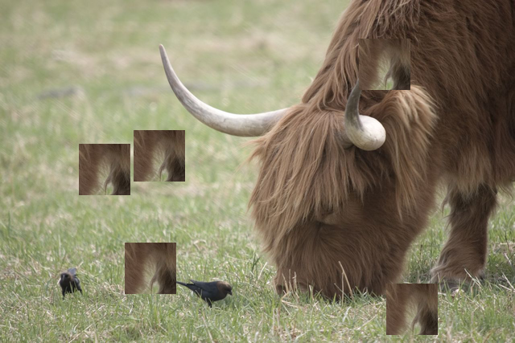
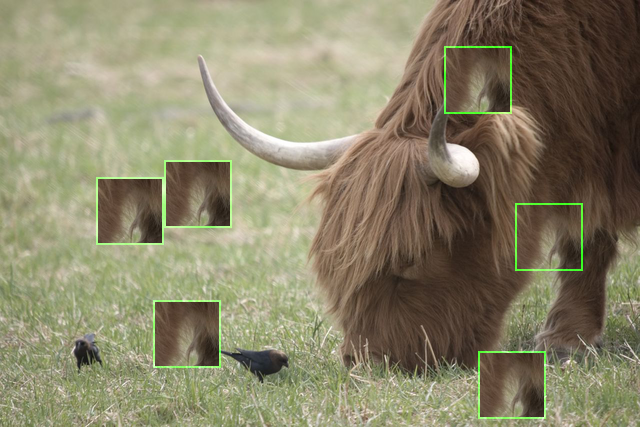
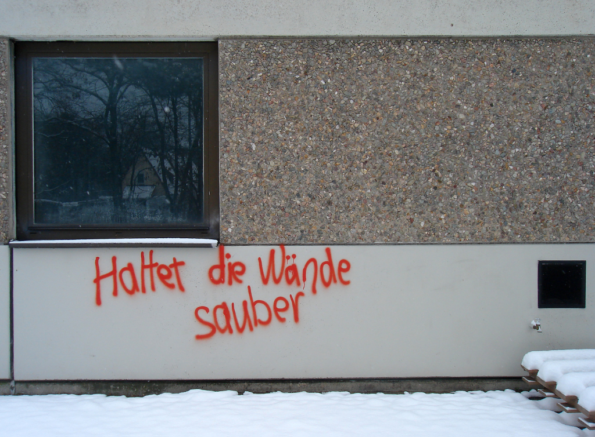
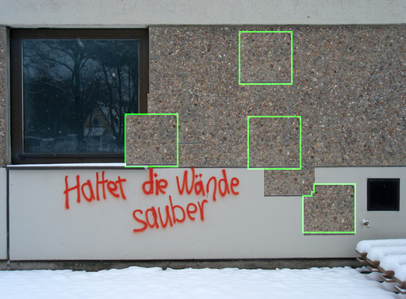
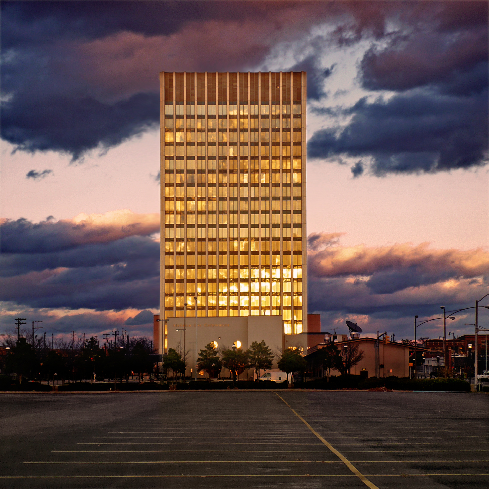
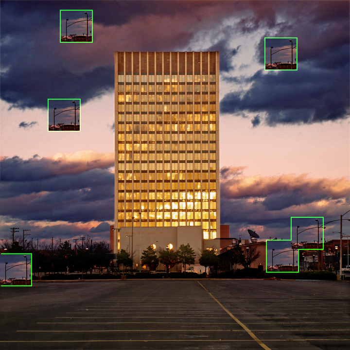

This is a python package for detecting copy-move attack on a digital image.

This project is part of our paper that [has been published at Springer](https://link.springer.com/chapter/10.1007%2F978-3-030-73689-7_39). More detailed theories and steps are explained there.


## Using the package

To install the package, simply hit it with pip: `pip3 install pimage`. Example script for using this package is also provided [here](https://github.com/rahmatnazali/pimage-example).

### Configuring the algorithm

The algorithm can be dynamically configured with `Configuration` class. If omitted, the default value from both of the paper will be used. 
The default value and description for each of the parameter is detailed on [configuration.py](src/pimage/configuration.py).

```python
from pimage.configuration import Configuration

conf = Configuration(
    block_size=32,
    nn=2,
    nf=188,
    nd=50,
    p=(1.80, 1.80, 1.80, 0.0125, 0.0125, 0.0125, 0.0125),
    t1=2.80,
    t2=0.02
)
```

- Determining the `block_size`: The first algorithm use block size of `32` pixels so this package will use the same value by default. Increasing the size means faster run time at a reduced accuracy. Analogically, decreasing the size means longer run time with increased accuracy.


### API for the detection process

- The API for detection process is provided via `copy_move.detect()` method. For example:

  ```python3
  from pimage import copy_move
  from pimage.configuration import Configuration
  
  conf = Configuration(block_size=32)
  
  fraud_list, ground_truth_image, result_image = copy_move.detect("dataset_example_blur.png", configuration=conf)
  ```

- `fraud_list` will be the list of `(x_coordinate, y_coordinate)` of the blocks group and the total number of the blocks it is formed with. If this list is not empty, we can assume that the image is being tampered. For example, running the [cattle dataset](dataset/multi_paste/cattle_gcs500_copy_rb5.png) with 32 px of block size will result in:
    ```
    ((-57, -123), 2178)
    ((-11, 140), 2178)
    ((-280, 114), 2178)
    ((-34, -305), 2178)
    ((-37, 148), 2178)
    ```
  the above output means there are 5 possible matched/identical region with 2178 overlapping blocks on each of it
- `ground_truth_image` contains the black and white ground truth of the detection result. This is useful for comparing accuracy, MSE, etc with the ground truth from the dataset
- `result_image` is the given image where the possible fraud region will be color-bordered (if any)

`ground_truth_image` and `result_image` will be formatted as `numpy.ndarray`. It can further be processed as needed. For example, it can be programmatically modified and then exported later as image like so:

```python
import imageio

imageio.imwrite("result_image.png", result_image)
imageio.imwrite("ground_truth_image.png", ground_truth_image)
```

### Quick command to detect an image

To quickly run the detection command for your image, the `copy_move.detect_and_export()` is also provided. The command is identical with `.detect()` but it also save the result to desired output path.

```python
from pimage import copy_move

copy_move.detect_and_export('dataset_example_blur.png', 'output')
```

this code will save the `ground_truth_image` and `result_image` inside `output` folder.

### Verbose mode

When running `copy_move.detect()` or `copy_move.detect_and_export()`, you can pass `verbose=True` to output 
the status of each step. The default value will be `False` so nothing will be printed.

Example output when verbose mode is being enabled:

```
Processing: dataset/multi_paste/cattle_gcs500_copy_rb5.png
Step 1 of 4: Object and variable initialization
Step 2 of 4: Computing characteristic features
100%|██████████| 609/609 [04:14<00:00,  2.39it/s]
Step 3 of 4:Pairing image blocks
100%|██████████| 241163/241163 [00:00<00:00, 816659.95it/s]
Step 4 of 4: Image reconstruction
Found pair(s) of possible fraud attack:
((-57, -123), 2178)
((-11, 140), 2178)
((-280, 114), 2178)
((-34, -305), 2178)
((-37, 148), 2178)
Computing time : 254.81 second
Sorting time   : 0.89 second
Analyzing time : 0.3 second
Image creation : 1.4 second
Total time    : 0:04:17 second 
```


## The algorithm
The implementation generally manipulates overlapping blocks, and are constructed based on two algorithms:
1. Duplication detection algorithm, taken from [Exposing Digital Forgeries by Detecting Duplicated Image Region](http://www.ists.dartmouth.edu/library/102.pdf) ([alternative link](https://www.semanticscholar.org/paper/Exposing-Digital-Forgeries-by-Detecting-Duplicated-Popescu-Farid/b888c1b19014fe5663fd47703edbcb1d6e4124ab)); Fast and smooth attack detection algorithm on digital image using [principal component analysis](https://en.wikipedia.org/wiki/Principal_component_analysis), but sensitive to noise and any following manipulations that are being applied after the attack phase (in which they call it _post region duplication process_)
2. Robust detection algorithm, taken from [Robust Detection of Region-Duplication Forgery in Digital Image](https://ieeexplore.ieee.org/document/1699948); Relatively slower process with rough result on the detection edge but are considered robust towards noise and _post region duplication process_

### How do we modify them?

We know that the first algorithm use `coordinate` and `principal_component` features, while the second algorithm use `coordinate` and `seven_features`.

Knowing that, we then attempt to give a tolerance by merging all the features like so:

 

The attributes are saved as one object. A lexicographical sorting is then applied to the principal component and the seven features.

The principal component will bring similar block closer, while the seven features will back up the detection for a block that can't be detected by principal component due to being applied with post region duplication process (for example being blurred).

By doing so, the new algorithm will have a tolerance regarding variety of the input image. The detection result will be relatively smooth and accurate for any type of image, with a trade-off in run time as we basically run two algorithm.


## Example image

All the result of the dataset should be inside `output` directory of this repository.

The image shown is ordered as: original, attacked, and the resulting detection image.

#### Horse dataset
 


#### Cattle dataset
 



#### Clean walls dataset
 



#### Knight moves dataset
 



## Additional note

The project is formerly written with Python 2 for our Undergraduate Thesis, which is now left unmaintained [here](https://github.com/rahmatnazali/image-copy-move-detection-python2). The original thesis is written in Indonesian that in any case can also be downloaded from [here](http://repository.its.ac.id/1801/).
